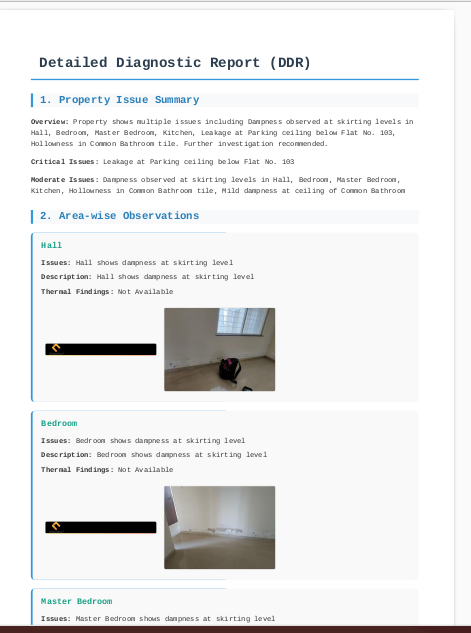
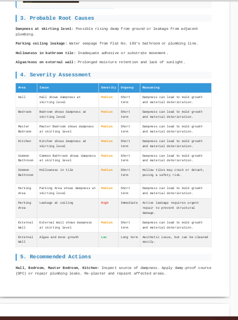

# 🏠 DDR Report Generator — AI-Powered Detailed Diagnostic Reports

> **AI Generalist | Applied AI Builder Assignment**  
> Converts raw site inspection PDFs into structured, client-ready Detailed Diagnostic Reports (DDR) using free LLMs — no credit card required.

---

## 🎥 Demo & Submission

| Resource | Link |
|----------|------|
| 🎬 Loom Video Walkthrough |https://drive.google.com/file/d/1_EFwqEw_8VyGscZcm5zxkz8g1c6bawco/view?usp=drive_link |
| 📁 Google Drive Folder | `https://drive.google.com/drive/folders/1xHzw92pzMejoul5QqB8lWha9coDcuAQs?usp=drive_link |


> 📸 **Screenshots**

<!-- Add your screenshots below -->
| Input PDFs | Generated DDR Report |
|------------|----------------------|
|  |  |

---

## 📌 What Is This?

This project is a **fully automated AI workflow** that:

1. Accepts two raw PDF documents — an **Inspection Report** and a **Thermal Images Report**
2. Extracts all text and embedded images from both PDFs
3. Sends the combined data to a **free LLM (Groq / HuggingFace / Ollama)**
4. Generates a structured **Detailed Diagnostic Report (DDR)** in HTML + PDF format

The output is a professional, client-ready report with area-wise observations, root cause analysis, severity ratings, and recommended actions — all sourced strictly from the input documents.

---

## ⚙️ System Architecture

```
┌─────────────────────────────────────────┐
│          INPUT: 2 PDF Files             │
│  • Inspection Report (text + images)    │
│  • Thermal Report    (thermal images)   │
└────────────────┬────────────────────────┘
                 │
       ┌─────────▼──────────┐
       │   PDF Extraction   │
       │  pdfplumber → Text │
       │  PyMuPDF   → Images│
       └─────────┬──────────┘
                 │
       ┌─────────▼──────────────────────┐
       │   Image Context Description    │
       │  LLM reads page text + image   │
       │  metadata → 1-line description │
       └─────────┬──────────────────────┘
                 │
       ┌─────────▼──────────────────────┐
       │   Free LLM: DDR Synthesis      │
       │   Groq (llama-3.1-8b-instant)  │
       │   OR HuggingFace Mistral-7B    │
       │   OR Ollama (local llama3)     │
       └─────────┬──────────────────────┘
                 │
   ┌─────────────▼──────────────────────┐
   │         OUTPUT FILES               │
   │  📄 DDR_Report.html  (with images) │
   │  📋 DDR_Report_Data.json           │
   │  📥 DDR_Report.pdf  (auto-download)│
   └────────────────────────────────────┘
```

---

## 📋 DDR Report Structure

The generated report always contains these 7 sections:

| # | Section | Description |
|---|---------|-------------|
| 1 | **Property Issue Summary** | High-level overview of all findings |
| 2 | **Area-wise Observations** | Room/zone-level breakdown with supporting images |
| 3 | **Probable Root Cause** | Logical analysis of why issues exist |
| 4 | **Severity Assessment** | Low / Medium / High rating with reasoning |
| 5 | **Recommended Actions** | Prioritised fix list in plain language |
| 6 | **Additional Notes** | Any extra context or observations |
| 7 | **Missing / Unclear Info** | Explicitly flags gaps as "Not Available" |

---

## 🆓 Supported Free AI Providers

| Provider | Model | Speed | Signup |
|----------|-------|-------|--------|
| ⭐ **Groq** *(recommended)* | llama-3.1-8b-instant | ⚡ Very Fast | [console.groq.com](https://console.groq.com) |
| **HuggingFace** | Mistral-7B-Instruct | 🐢 Slower | [huggingface.co](https://huggingface.co/settings/tokens) |
| **Ollama** *(local)* | llama3 | Varies | No key needed |

> All providers are **100% free** — no credit card, no paid plan required.

---

## 🚀 Quick Start (Google Colab)

### Step 1 — Open the Notebook
Click the **Open in Colab** badge above, or upload `ddr_report_generator.ipynb` manually.

### Step 2 — Get a Free Groq API Key
1. Go to [console.groq.com](https://console.groq.com) → Sign up (30 seconds, no card)
2. Navigate to **API Keys** → **Create Key** → Copy it

### Step 3 — Run the Cells in Order

| Cell | Action |
|------|--------|
| **Cell 1** | Install packages (`pymupdf`, `pdfplumber`, `Pillow`, `requests`) |
| **Cell 2** | Paste your Groq API key, select provider |
| **Cell 3** | Test AI connection |
| **Cell 4** | Upload your 2 PDF files |
| **Cell 5** | Extract text + images from both PDFs |
| **Cell 6** | Generate AI descriptions for each image |
| **Cell 7** | Synthesise full DDR report via LLM |
| **Cell 8** | Export to HTML + auto-download PDF |

### Step 4 — Download Your Report
The final `DDR_Report.pdf` downloads automatically to your local machine.

---

## 📁 Project Structure

```
ddr-report-generator/
│
├── ddr_report_generator.ipynb   # Main Colab notebook (all logic here)
├── README.md                    # This file
│
├── sample_inputs/               # Example input documents
│   ├── Sample Report.pdf        # Inspection report (text + images)
│   └── Thermal Images.pdf       # Thermal scan report (images)
│
├── sample_outputs/              # Example generated reports
│   ├── DDR_Report.html
│   ├── DDR_Report.pdf
│   └── DDR_Report_Data.json
│
└── screenshots/                 # UI and output screenshots
    ├── input_pdfs.png
    ├── ddr_output.png
    └── colab_run.png
```

---

## 🧠 Why Google Colab?

Colab was chosen intentionally over a local script or web app for these reasons:

### ✅ Zero Setup for Anyone
No Python installation, no virtual environments, no dependency conflicts. Anyone with a Google account can run this in under 2 minutes.

### ✅ Free GPU/CPU Resources
Colab provides free compute that handles PDF processing and LLM API calls without any cost to the user.

### ✅ Built-in File Upload/Download UI
`google.colab.files.upload()` and `files.download()` give a clean drag-and-drop experience directly inside the notebook — no file path configuration needed.

### ✅ Reproducible & Shareable
A single `.ipynb` file contains the entire pipeline. Sharing is one link. Reviewers can run it themselves without cloning or configuring anything.

### ✅ Future Accuracy Improvements Are Easy
Upgrading the model (e.g., switching to `llama-3.3-70b` on Groq, or adding Claude/GPT-4 as an option) requires changing **one line** in Cell 2. The modular cell structure makes prompt engineering, model swapping, and output formatting trivial to iterate on.

### ✅ Transparent Execution
Each cell shows its output inline — extracted text counts, image counts, AI responses, and errors are all visible. This makes debugging and validation straightforward.

---

## 🔮 How Accuracy Can Be Improved (Future Scope)

| Improvement | How |
|-------------|-----|
| **Vision-capable LLM** | Switch to GPT-4o or Claude 3 to directly analyse thermal images rather than relying on text context descriptions |
| **Larger model on Groq** | Use `llama-3.3-70b` for richer, more accurate synthesis |
| **Structured JSON output** | Add function calling / tool use so the LLM returns validated JSON rather than free-text |
| **Better image-to-section mapping** | Use page number and heading proximity to assign images to the correct DDR section automatically |
| **Multi-pass refinement** | Run a second LLM pass to check for invented facts, contradictions, and missing fields |
| **Conflict detection** | Add explicit logic to compare inspection text vs thermal readings and flag discrepancies |
| **Google Drive integration** | Auto-save outputs to a Drive folder instead of download-only |

---

## ⚠️ Known Limitations

- **Thermal images are text-blind:** The thermal PDF has 0 chars of text. Image descriptions are inferred from page context, not actual visual analysis. A vision LLM would dramatically improve this.
- **60-image limit:** The extractor caps at 30 images per PDF to avoid token overflow. Large reports may have images skipped.
- **LLM hallucination risk:** The prompt strictly instructs the model not to invent facts, but free smaller models (8B parameters) can occasionally add minor inferences. Always review the output.
- **PDF conversion fallback:** If `wkhtmltopdf` fails on some environments, the system falls back to WeasyPrint or pdfkit. HTML output is always available as a fallback.
- **Rate limits:** Groq free tier allows ~30 requests/minute. If Cell 7 hits a 429 error, wait 60 seconds and re-run.

---

## 🛠️ Dependencies

```
pymupdf        # PDF image extraction (PyMuPDF / fitz)
pdfplumber     # PDF text extraction
Pillow         # Image processing
requests       # HTTP calls to AI APIs
wkhtmltopdf    # HTML to PDF conversion (installed via apt in Colab)
```

All installed automatically in **Cell 1**. No manual setup required.

---

## 📐 Design Principles

- **No invented facts** — the LLM is explicitly prompted to write "Not Available" rather than guess
- **Conflict transparency** — if inspection text contradicts thermal findings, the conflict is surfaced in the report
- **Client-friendly language** — technical jargon is minimised; the report is readable by a property owner
- **Generalisable** — the system works on any two-PDF inspection + thermal input, not just the sample files

---

## 📬 Submission Checklist

- [x] Working Colab notebook
- [ ] Loom video (3–5 min walkthrough)
- [ ] GitHub repository link
- [ ] Google Drive folder with all files
- [ ] Screenshots of input and output

---

*Built for the AI Generalist | Applied AI Builder assignment.*
